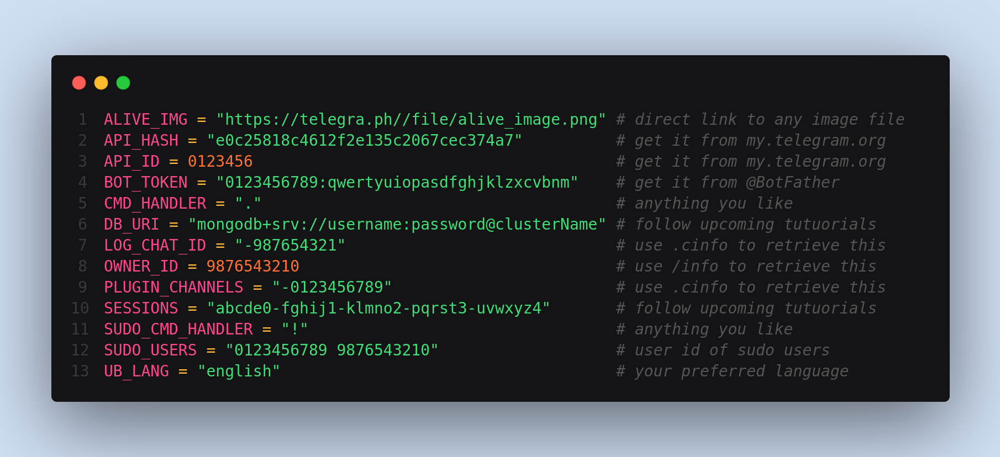

<h1 align="center"><b>Altruix | UserBot</b></h1>
<p align="center"><br></p>  

#### **Altruix** | A Modern yet simple UserBot which is based on Pyrogram. **Built By The Developers Of Friday Userbot.** 
<br>

# Deploying To Different Platforms
> - For deploying [Locally](#Deploy-Locally)

<br>

# Official Support/Updates
> - Join the official **Updates** Channel  
>    <a href="https://t.me/AltruiXUB"></a>  
> - Join the official **Support** Chat  
>    <a href="https://t.me/AltruixChat"></a>

<br>

## Deploy Locally

If you want to Deploy your Altruix UserBot on your PC or in Termux these are the steps -

> ```
> git clone https://github.com/Altruix/Altruix
> cd Altruix
> nano .env
> bash start.sh
> ```

Example of [`.env`](#env)

<br>

## String Session

It's not necessary until you host the bot. You can get the String Session after you are done with hosting. Just run the Altruix Assistant bot and walk through the steps. 

## Required Variables

> Following are the required variables for the proper working of userbot, note down these somewhere for easier access so that you may use them in future:

<details close>

  > These are used to communicate with the telegram servers. You can get you your `API_HASH` and `API_ID` from [Telegram](my.telegram.com) by following the given steps:
  > - Go to [my.telegram.com](my.telegram.com).
  > - Login via adding your mobile number in the international format i.e `+00 9876543210`.
  > - You will receive an `11` character alphanumeric code via the Telegram App. Input this code into the input field and proceed.
  > - Now click on [API development tools](https://my.telegram.org/apps).
  > - Here you may add an `App title` and a `Short name` for it (they can be anything). Note down the `APP api_id` and `APP api_hash` for future use. Scroll down to the end of the page and click on `Save changes` button.

<summary> API_ID </summary>
</details>

<details close>

  > These are used to communicate with the telegram servers. You can get you your `API_HASH` and `API_ID` from [Telegram](my.telegram.com) by following the given steps:
  > - Go to [my.telegram.com](my.telegram.com).
  > - Login via adding your mobile number in the international format i.e `+00 9876543210`.
  > - You will receive an `11` character alphanumeric code via the Telegram App. Input this code into the input field and proceed.
  > - Now click on [API development tools](https://my.telegram.org/apps).
  > - Here you may add an `App title` and a `Short name` for it (they can be anything). Note down the `APP api_id` and `APP api_hash` for future use. Scroll down to the end of the page and click on `Save changes` button.

<summary> API_HASH </summary>
</details>

<details close>

  > It's used to control your bot's actions etc. You can get your `BOT_TOKEN` for your bot by following the given steps:
  > - Go to [@BotFather](t.me/BotFather).
  > - Do `/start` -> `/newbot`
  > - You'll be prompted to choose a name for your bot (it can be anything).
  > - You'll be prompted to choose a username name for your bot (it can be anything but should end with suffix `bot`).
  > - Your bot with the above details will be made! And a message containg your bots api token will also be sent.

<summary> BOT_TOKEN </summary>
</details>

<details close>

  > TO BE DONE

<summary> DB_URI </summary>
</details>

<details close>

  > It's used to tell your bot who is the owner of this bot and whom commands it should fulfil. Only the person with this ID can give the bot command to add more sessions to the database via `/add`.
  > - Go to [@MissRose_Bot](t.me/MissRose_Bot).
  > - Do `/start` -> `/info`
  > - You'll receive a message containing your ID.

<summary> OWNER_ID </summary>
</details>

<br>

## .env

<details close>
<p align="center"><br></p>
<summary> An example of how your `.env` file should look like: </summary>
</details>

<br>

## About the Repo

> Currently Running Stable version of Altruix.  
> [](#)  
> Is our project under active maintenance?  
> [](https://github.com/Altruix/Altruix/graphs/commit-activity)   
> Developers aka Contributors for the Project.  
> [](https://github.com/Altruix/Altruix/graphs/contributors)

## Credits

> - <a href="https://www.github.com/EverythingSuckz">    EverythingSuckz    </a>
> - <a href="https://www.github.com/StarkGang">          StarkGang          </a>
> - <a href="https://www.github.com/BilakshanP">         BilakshanP         </a>
> - <a href="https://www.github.com/Reeshuxd">           Reeshuxd           </a>
> - <a href="https://www.github.com/Rohith-Sreedharan">       Rohithaditya       </a>
> - <a href="https://www.github.com/StarkBotIndustries"> StarkBotIndustries </a>
> - <a href="https://www.github.com/sohag02">            sohag02            </a>
> - <a href="https://www.github.com/SHRE-YANSH">         SHRE-YANSH         </a>
> - <a href="https://www.github.com/lostb053">           lostb053           </a>
> - <a href="https://www.github.com/Nksama">             Nksama             </a>
> - <a href="https://www.github.com/Crackexy">           Crackexy           </a>
> - <a href="https://www.github.com/anonyindian">        anonyindian        </a>
> - <a href="https://www.github.com/N0BLEWOLF">          N0BLEWOLF          </a>
> - <a href="https://www.github.com/ramanveerji">        ramanveerji        </a>
> - <a href="https://www.github.com/swatv3nub ">         swatv3nub          </a>

<p align="center">
  
</p>
